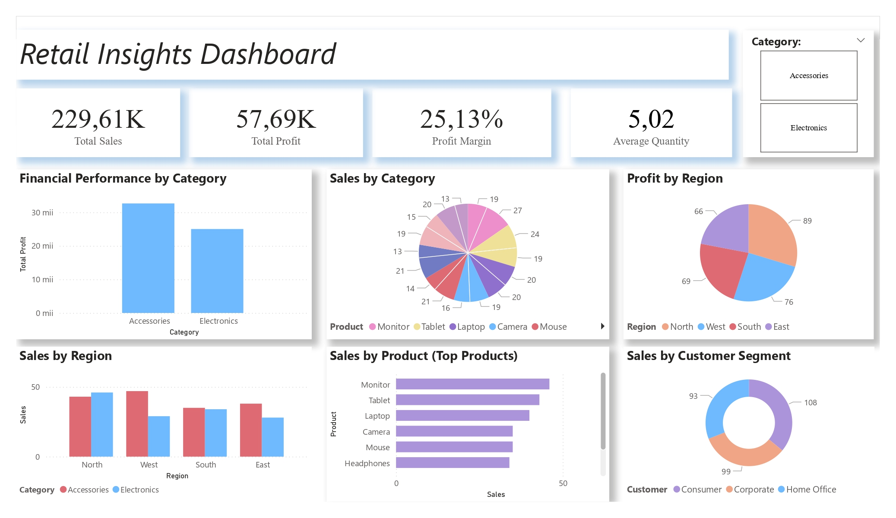

# Lorena-Cristina Ionita – Data Analyst Portfolio

# Projects

# Retail Dashboard Insight
  This project presents a Power BI dashboard designed to analyze key performance metrics for a retail business. It provides a clear overview of total sales (229.61K), total profit (57.69K), profit margin (25.13%), and average quantity sold (5.02), offering a snapshot of overall business health.
  The dashboard breaks down performance by product categories and top products, helping identify which items drive the most revenue and profit. It also includes a regional analysis across North, West, South, and East, revealing geographic trends in both sales and profitability. Additionally, customer segments such as Consumer, Corporate, and Home Office are compared to understand differences in purchasing behavior.
  As an aspiring data analyst, this project demonstrates my ability to clean and interpret data, build interactive visualizations, and translate complex information into meaningful insights that support business decision-making.

# Foreign Direct Investments in Romania
- Analyzed investment trends using Excel
**Link:** https://1drv.ms/w/c/eebe9cd6ee1b2fa5/EaMwSaHYppBIihVAt_hHGH4B47QXPe22CCWLdQdn_jcFFg
# Cyberbullying Impact on Youth
- Applied SWOT, PESTLE, POPIT, MoSCoW, McKinsey, BCG frameworks
**Link:** https://1drv.ms/w/c/eebe9cd6ee1b2fa5/EaMwSaHYppBIihVAt_hHGH4B47QXPe22CCWLdQdn_jcFFg
  
## Skills

**Technical / Data Skills:**  
SQL & PL/SQL – Intermediate | Excel – Intermediate | Power BI – Intermediate | R / R Studio – Intermediate | Python – Beginner | EViews – Beginner  
**Data Analysis & Visualization:**  
Data Analytics, Regression, KNN, Naive Bayes, Supervised & Unsupervised Learning  
**Tools / Platforms:**  
Jira, Confluence, Google Drive  
**Soft Skills:**  
Analytical Thinking, Problem Solving, Teamwork, Attention to Detail, Communication, Adaptability  
**Languages:**  
English – Upper-Intermediate (B2)  

# Contact
- Email: ionitalorena11@gmail.com
- Linkedin: https://www.linkedin.com/in/lorena-cristina-ioni%C8%9B%C4%83-01865630b/
- GitHub: [ionitalorenacristina.github.io](https://ionitalorenacristina.github.io)
